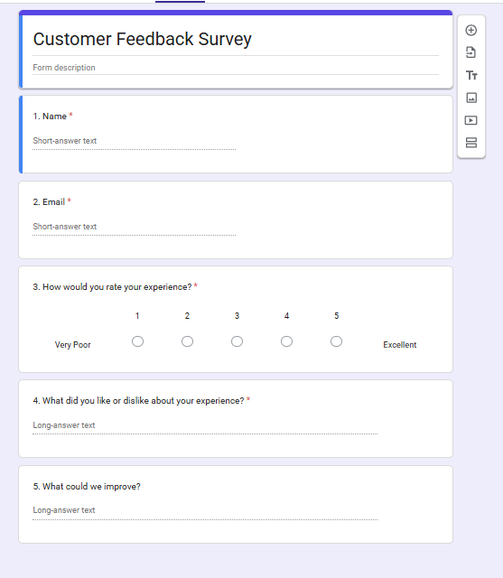
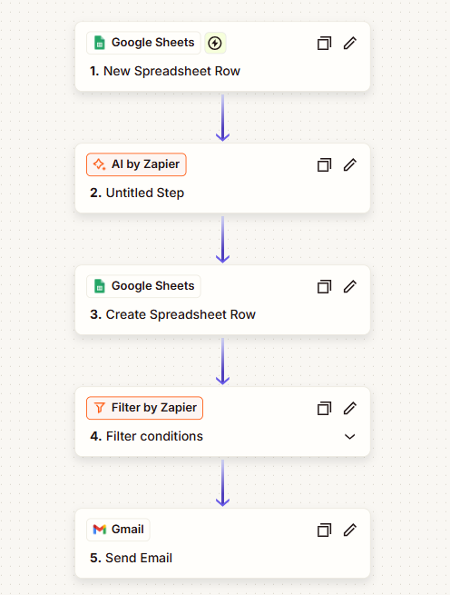
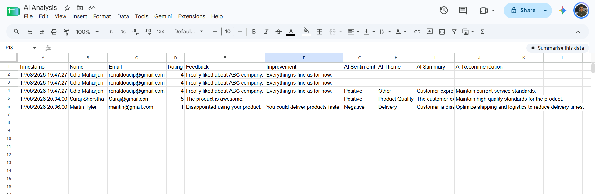
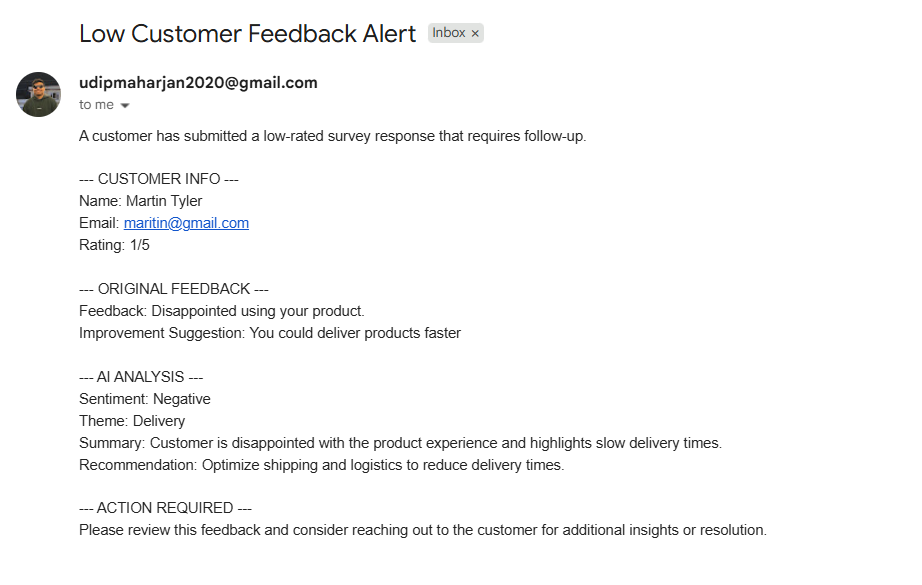

# AI-Powered Customer Feedback Automation

An automated customer survey and feedback analysis workflow built
using Zapier, Google Forms, Google Sheets, AI by Zapier, and Gmail.

## Overview

This project automates the processing of customer survey responses.

A customer submits feedback through Google Forms. The response is
captured in Google Sheets and automatically processed by Zapier.
AI analyzes the qualitative feedback and produces structured
sentiment, theme, summary, and recommendation fields.

Low-rated responses are automatically routed to a Gmail alert.

## Workflow

Google Form
     ↓
Google Sheets
     ↓
Zapier Trigger
     ↓
AI by Zapier
     ↓
Google Sheets - AI Analysis
     ↓
Filter: Rating ≤ 2
     ↓
Gmail Alert

## Technologies

- Zapier
- Google Forms
- Google Sheets
- AI by Zapier
- Gmail

## Key Features

- Automated survey response capture
- AI-powered sentiment classification
- Feedback theme classification
- Feedback summarization
- Improvement recommendations
- Structured AI output
- Conditional workflow routing
- Automated email alerts

## AI Analysis

The AI analyzes each customer response and returns four structured
fields:

### Sentiment

Classifies the feedback as:

- Positive
- Neutral
- Negative

### Theme

The feedback is categorized into one of the following:

- Product Quality
- Customer Support
- Delivery
- Pricing
- Usability
- Installation
- Other

### Summary

A concise summary of the customer's feedback.

### Recommendation

A practical improvement based on the customer's feedback.

## Workflow Logic

1. A customer submits the Google Form.
2. Google Forms stores the response in Google Sheets.
3. Zapier detects the new spreadsheet row.
4. AI by Zapier analyzes the rating and qualitative feedback.
5. The AI results are stored in a separate `AI Analysis` worksheet.
6. A filter checks whether the rating is less than or equal to 2.
7. If the condition is met, Gmail sends a low-feedback alert.

## Example

### Customer Input

Rating: 2

Feedback:

> The product is good, but customer support took several days
> to respond.

### AI Analysis

Sentiment: Negative

Theme: Customer Support

Summary:
Customer is dissatisfied with the slow response from customer support.

Recommendation:
Improve customer support response time.

### Automation

Because the rating is 2, the workflow sends an automated email
alert for follow-up.

## Screenshots

### Survey Form

### Zapier Workflow

### AI Analysis Sheet

### Email Alert

## Project Purpose

This project demonstrates practical experience with:

- Workflow automation
- Trigger-based automation
- AI/LLM text analysis
- Sentiment analysis
- Text classification
- Data mapping
- Conditional routing
- Automated notifications